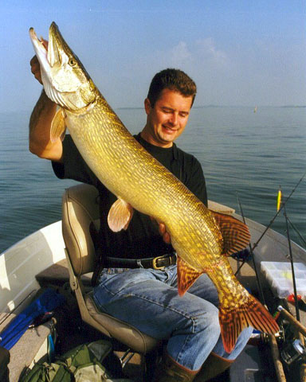
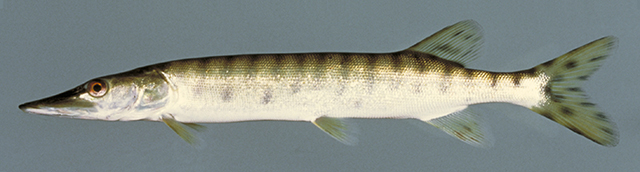
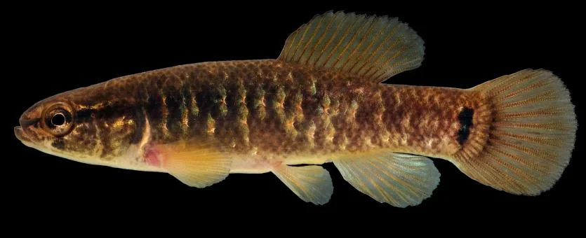

---
output:
  html_document:
    df_print: paged
---
```{r, include=FALSE}
knitr::opts_chunk$set(
  echo = FALSE
)
```
<div style="background-color:rgba(255, 255, 255, 0.8); padding:40px 0;">
## Osteoglossiformes families {.tabset}

### Hiodontidae
```{r fig.align ='center', fig.cap="https://www.fishbase.de/photos/PicturesSummary.php?id=2667&picname=Hiter_u0.jpg&what=species"}
knitr::include_graphics("pictures/mooneye.jpg")
```

### Osteoglossidae
```{r out.width=c('50%','50%'), fig.show='hold', fig.cap="https://www.fishbase.de/photos/PicturesSummary.php?id=6234&picname=Osbic_u0.jpg&what=species, https://www.fishbase.de/photos/PicturesSummary.php?id=2076&picname=Argig_u1.jpg&what=species"}
knitr::include_graphics("pictures/arowana.jpg")
knitr::include_graphics("pictures/arapaima.jpg")
```
## Family Esocidae

The key identifying features of family Esocidae is a elongate body and head with a broad snout. The elongate head is what seperates family Esocidae from family Umbridae. The anal fins and dorsal fins are set well back on the body. There is no adipose fin present.


### Northern Pike (*Esox lucius*)
```{r class.source="badCode", fig.align ='center', fig.cap="https://www.fishbase.de/photos/PicturesSummary.php?StartRow=8&ID=258&what=species&TotRec=20"}

```

### Muskellunge (*Esox masquinongy*)
```{r fig.align='center', fig.cap="https://www.fishbase.de/photos/PicturesSummary.php?StartRow=0&ID=2711&what=species&TotRec=6"}

```

To distinguish between Northern Pike and Muskellunge, inspect the side of the body. If the body has a dark background with light markings, it is a Northern Pike. If the body has a light background with dark markings, it is a Muskellunge.

## Family Umbridae
The anal fins and dorsals fins are set well back on the body and no adipose fin is present, similar to family Esocidae.These fish differ from family Esocidae because there heads are not as pronounced (torpedolike)

### Central mudminnow (*Umbra limi*)
```{r fig.align='center', fig.cap="https://mdc.mo.gov/discover-nature/field-guide/central-mudminnow"}

```
</div>

</div>