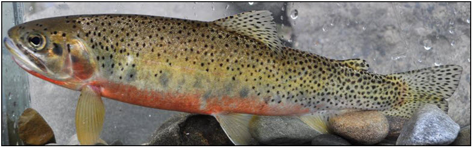
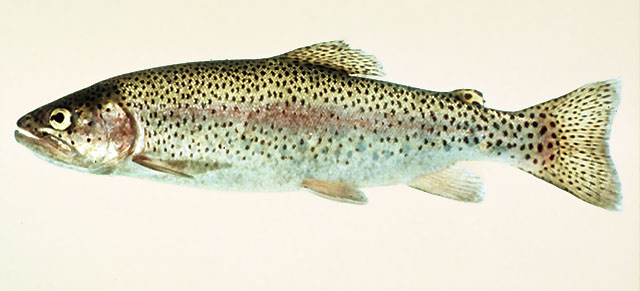
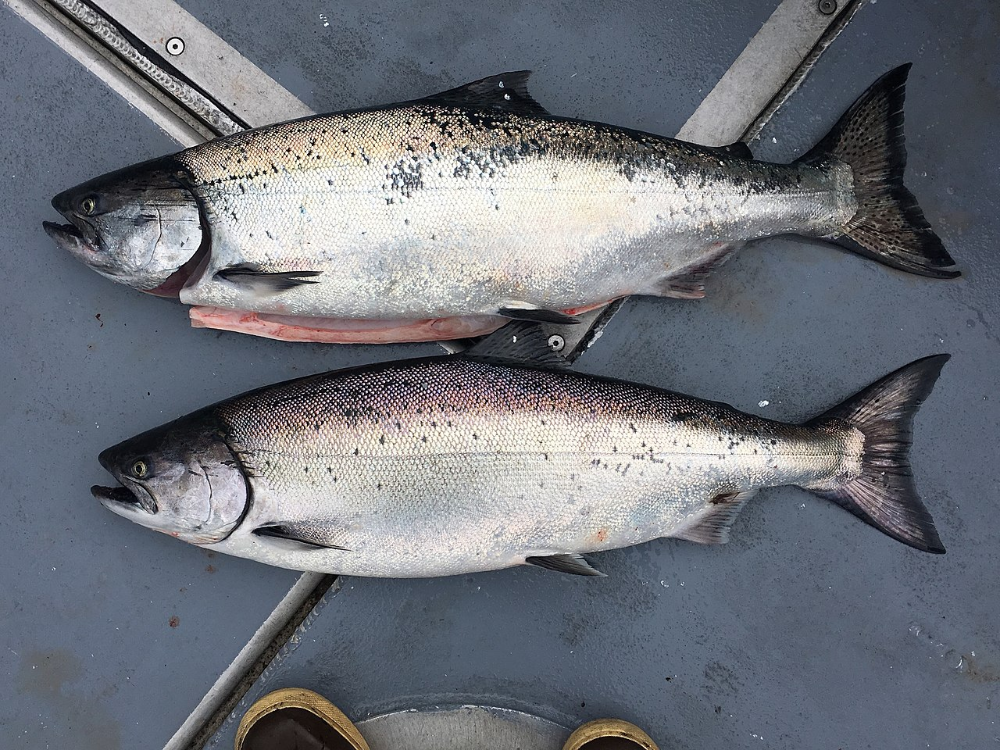
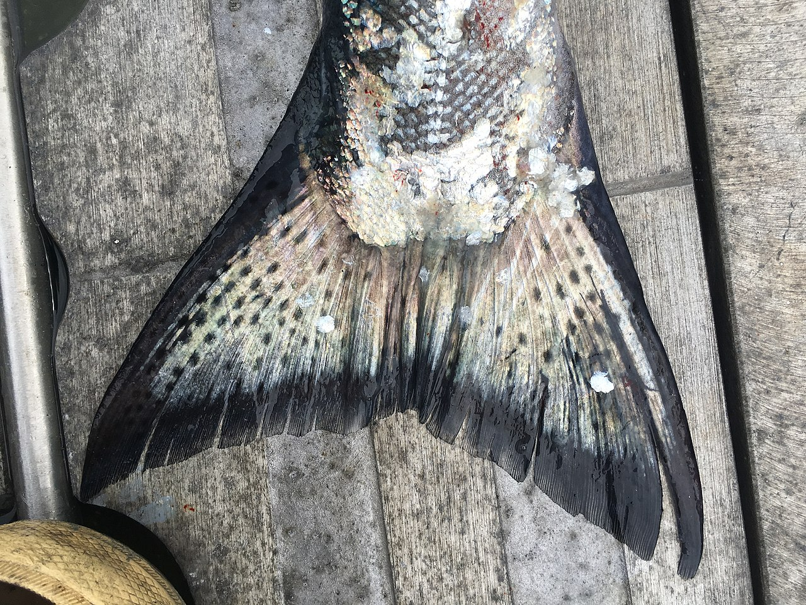
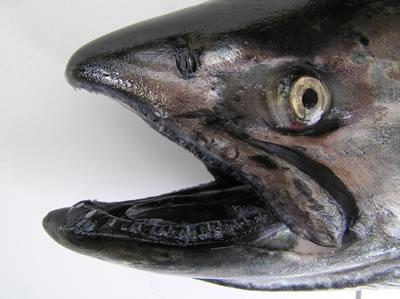

---
output:
  html_document:
    df_print: paged
---
```{r, include=FALSE}
knitr::opts_chunk$set(
  echo = FALSE
)
```
<div style="background-color:rgba(255, 255, 255, 0.8); padding:40px 0;">
# Order Salmoniformes

## Family Salmonidae

### Subfamily Salmoninae

#### Cutthroat trout (*Oncorhynchus mykiss*)
```{r fig.align ='center',fig.cap="https://www.fishbase.de/photos/PicturesSummary.php?StartRow=7&ID=239&what=species&TotRec=21"}

```

#### Rainbow trout (*Oncorhynchus clarkia*)
```{r fig.align='center', fig.cap="https://www.canada.ca/en/environment-climate-change/services/species-risk-public-registry/cosewic-assessments-status-reports/westslope-cutthroat-trout-2016.html"}

```

Both the Cutthroat and Rainbow trout have spots all over their body with radiating rows of spots on the caudal fin. To tell the two species apart, observe the lower jaw. If there is an orange-red slash on the lower jaw, it is a Cutthroat trout. If there is no orange-red slash, it is a Rainbow trout.


#### Chinook salmon (*Oncorhynchus tshawytscha*)

To identify chinook salmon from other closely related species, observe the mouth and caudal fin. Chinook salmon have black mouths with black gums and small round spots on their caudal fin.
```{r out.width=c('33%','33%','33%'), fig.show='hold', fig.cap="https://www.wikiwand.com/en/Chinook_salmon, https://www.eopugetsound.org/magazine/pcb-blackmouth"}



```
</div>